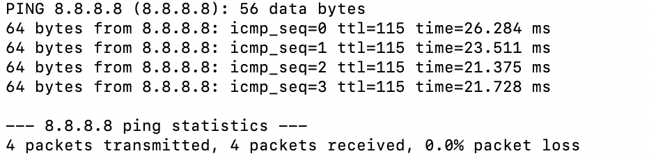
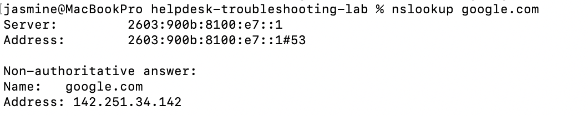
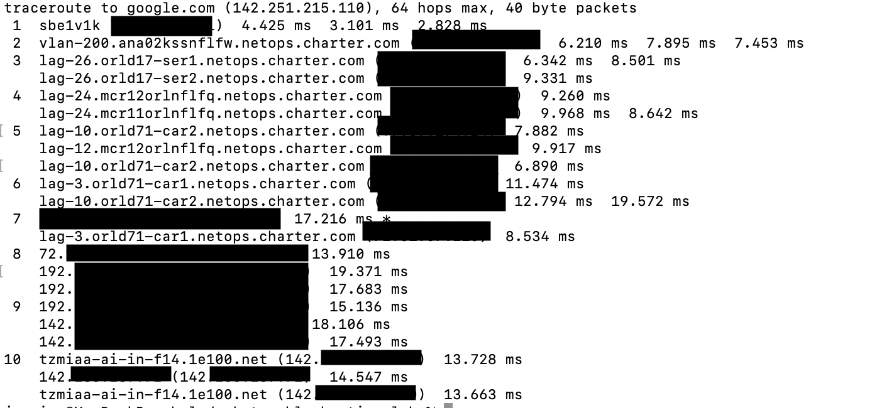

# INC-001 — Network Connectivity

## User Report

User reports that they are unable to access websites.

## Impact

One user is affected.

## Priority

Medium

## Initial Investigation

The following troubleshooting steps will be performed:

1. Check network configuration.
2. Test local connectivity.
3. Test external IP connectivity.
4. Test DNS resolution.
5. Review the network route.

## Commands Used

```bash
ifconfig
ping -c 4 127.0.0.1
ping -c 4 8.8.8.8
nslookup google.com
traceroute google.com

```

## Findings

### Network Configuration

The system's network configuration was reviewed using `ifconfig`.

A valid local IP address was present, indicating that the system had an active network configuration.

### Local Connectivity

The command:

`ping -c 4 127.0.0.1`

was successful with no packet loss.

This confirmed that the local TCP/IP stack was functioning correctly.

### External Connectivity

The command:

`ping -c 4 8.8.8.8`

was successful.

This confirmed that the system could reach an external IP address.

### DNS Resolution

The command:

`nslookup google.com`

successfully resolved the domain name to an IP address.

This confirmed that DNS resolution was functioning.

### Network Route

`traceroute google.com` successfully displayed the network path toward the destination.

## Root Cause

No network connectivity problem was identified during testing.

## Resolution

No corrective action was required.

## Verification

Local connectivity, external connectivity, DNS resolution, and network routing were successfully verified.

## Status

Resolved

## Evidence

### Network Configuration


The `ifconfig` output confirms that the system had an active network interface and valid IPv4 configuration.

### External Connectivity



The ping test to 8.8.8.8 completed successfully with no packet loss, confirming external IP connectivity.

### DNS Resolution



The `nslookup` test successfully resolved google.com to an IP address, confirming DNS resolution.

### Network Route



The traceroute command displayed multiple network hops toward the destination, allowing the network path to be examined.