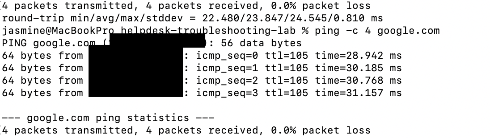
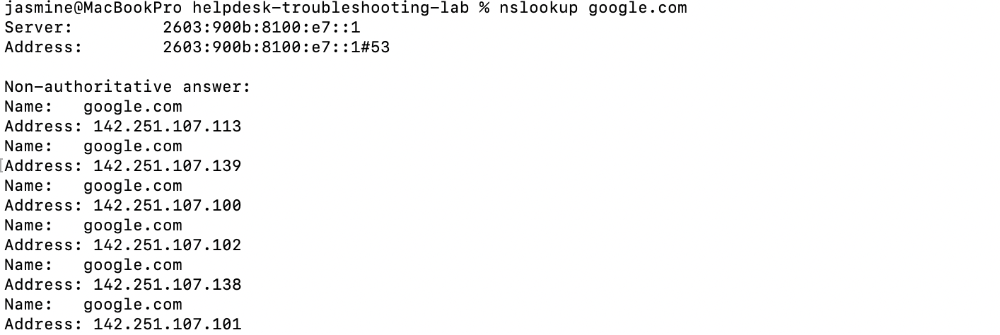
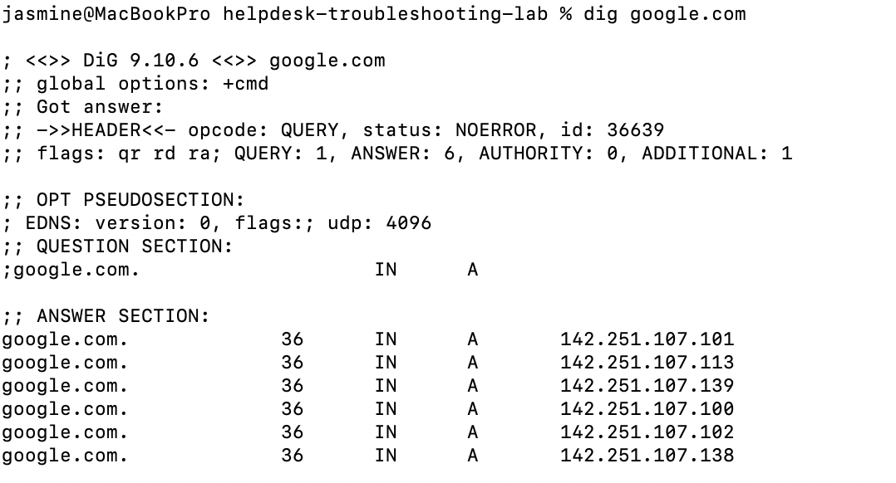

# INC-002 — DNS Troubleshooting

## User Report

User reports that they are unable to access websites by name.

## Impact

One user is affected.

## Priority

Medium

## Initial Investigation

The following troubleshooting steps will be performed:

1. Test Internet connectivity using an IP address.
2. Test connectivity using a domain name.
3. Perform DNS lookup using `nslookup`.
4. Perform DNS lookup using `dig`.
5. Compare the results.

## Commands Used

```bash
ping -c 4 8.8.8.8
ping -c 4 google.com
nslookup google.com
dig google.com
```

## Findings

### External IP Connectivity

The command:

`ping -c 4 8.8.8.8`

completed successfully.

This confirmed that the workstation could communicate with an external IP address.

### Domain Connectivity

The command:

`ping -c 4 google.com`

completed successfully.

This confirmed that the workstation could resolve the domain name and communicate with the destination.

### DNS Resolution — nslookup

The command:

`nslookup google.com`

successfully returned DNS information for the domain.

This confirmed that DNS name resolution was functioning correctly.

### DNS Resolution — dig

The command:

`dig google.com`

successfully returned DNS query information, including an answer for the domain.

This provided additional confirmation that DNS resolution was functioning.

## Root Cause

No DNS-related failure was identified during testing.

## Resolution

No corrective action was required.

## Verification

External IP connectivity, domain connectivity, and DNS resolution were successfully verified using multiple diagnostic tools.

## Evidence

### Domain Connectivity



### DNS Lookup



### DNS Query



## Status

Resolved