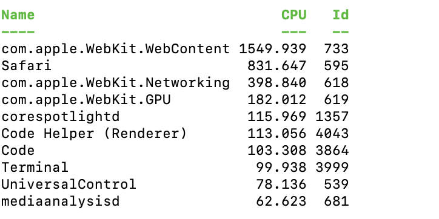
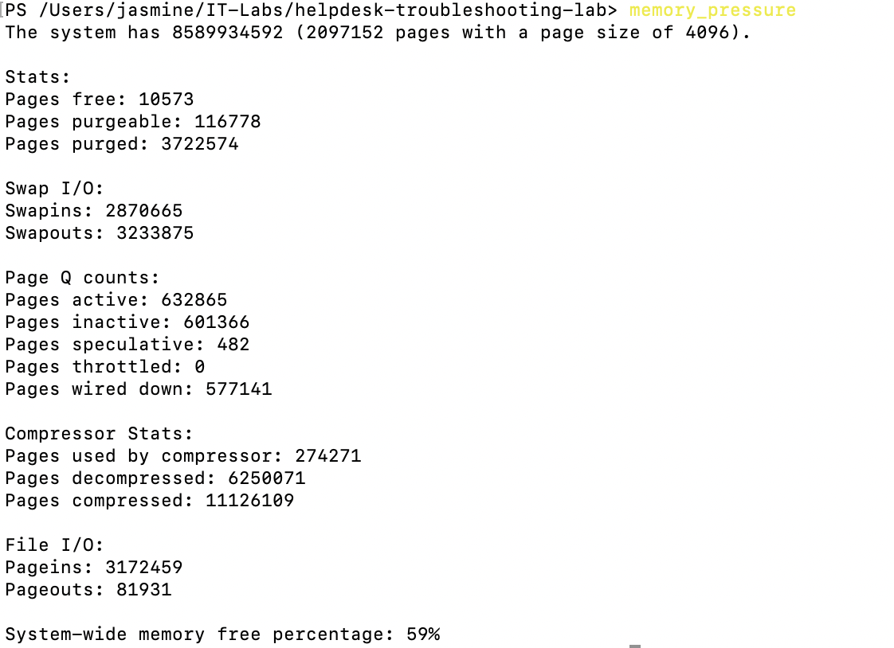
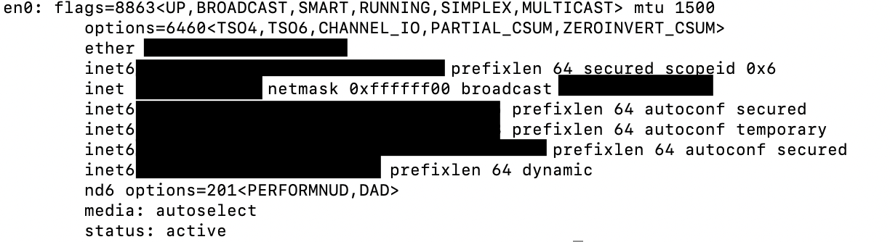
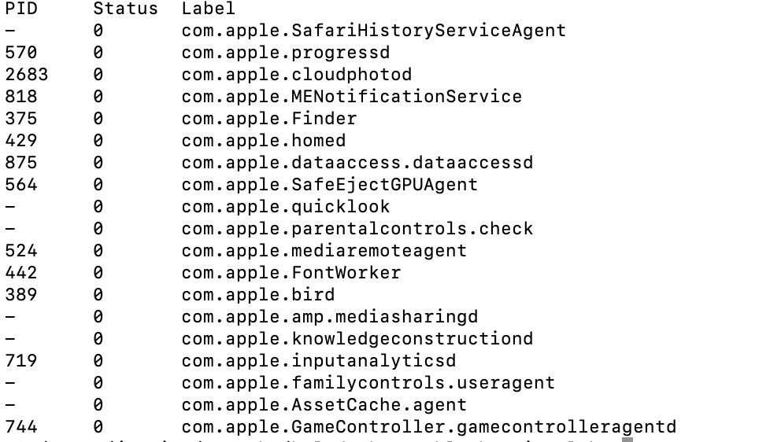

# INC-003 — System Performance Troubleshooting

## User Report

User reports that their computer is running slowly and applications are taking longer than expected to respond.

## Impact

One user is affected.

## Priority

Medium

## Initial Investigation

The following areas will be investigated:

1. System information
2. Running processes
3. CPU utilization
4. Memory utilization
5. Disk/storage availability
6. Network configuration
7. Running services

## Tools Used

- PowerShell
- `Get-ComputerInfo`
- `Get-Process`
- `Get-Service`
- `Get-Volume`
- `Get-NetIPConfiguration`

## Findings

### CPU Investigation

PowerShell process analysis identified several Safari and WebKit processes among the highest cumulative CPU-time consumers.

The primary WebKit content process accumulated significant CPU time during the investigation.

Because the CPU values reported by `Get-Process` represent cumulative CPU time rather than instantaneous CPU percentage, the results were treated as indicators for further investigation rather than proof of sustained CPU saturation.

### Memory Investigation

Safari/WebKit processes were also among the largest memory consumers observed.

The largest WebKit process used approximately 782 MB of memory during the final observation.

The system contains 8 GB of physical memory.

### Memory Pressure

The macOS `memory_pressure` utility reported approximately 59% system-wide memory free.

This did not provide evidence of severe memory exhaustion at the time of testing.

### Disk Investigation

The root filesystem had approximately 197 GiB of available storage with only 6% capacity utilized.

Low disk space was therefore ruled out as a likely cause of the reported performance issue.

### Network Investigation

The `en0` network interface was confirmed to be active and in a running state.

No inactive network interface was identified during the investigation.

### Service Investigation

The macOS `launchctl` utility was used to inspect jobs managed by the macOS `launchd` service manager.

No obvious service failure was identified from the initial inspection.

## Root Cause

The investigation did not identify a definitive hardware or operating-system failure.

The most likely contributing factor observed was resource-heavy browser activity involving Safari and WebKit processes.

Additional investigation of open Safari tabs, extensions, and browser activity would be appropriate if the user continued experiencing performance problems.

## Resolution

Recommended troubleshooting actions include:

1. Review and close unnecessary Safari tabs.
2. Review Safari extensions and disable unnecessary extensions.
3. Restart Safari.
4. Restart the computer if performance remains degraded.
5. Recheck CPU and memory utilization after the changes.

## Verification

System performance was evaluated using PowerShell and native macOS utilities.

The investigation confirmed:

- Safari/WebKit processes were significant resource consumers.
- Severe memory pressure was not observed.
- Low disk space was ruled out.
- The network interface was active.
- macOS service jobs were inspected.

A final performance verification should be performed after closing unnecessary browser activity and restarting Safari.

## Evidence

### Top CPU Processes

### Memory Usage by Process

### System Memory

### Disk Space

### Memory Pressure

### Network Configuration

### Running Services

## Platform Notes

Several Windows-specific PowerShell cmdlets were unavailable in the macOS environment, including:

- `Get-ComputerInfo`
- `Get-NetIPConfiguration`
- `Get-Service`

Equivalent macOS utilities were used where appropriate, including:

- `system_profiler`
- `sysctl`
- `ifconfig`
- `memory_pressure`
- `launchctl`

This demonstrates adaptation of troubleshooting techniques across operating systems.

## Status

Resolved - Probable cause identified; recommended remediation documented.