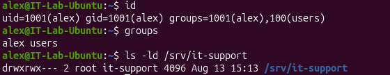
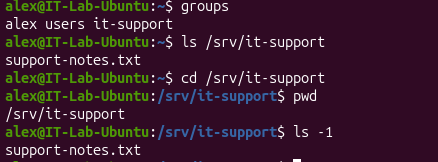

# INC-004 — Linux User & File Permission Troubleshooting

## User Report

A user reports that they are unable to access a shared department directory on a Linux workstation.

## Impact

One user is unable to access files required for their job.

## Priority

Medium

## Environment

- Ubuntu Linux virtual machine
- Oracle VirtualBox
- Linux command line

## Initial Investigation

The following areas will be investigated:

1. Verify the affected user account.
2. Review the user's group memberships.
3. Inspect the shared directory.
4. Review directory ownership.
5. Review Linux file permissions.
6. Reproduce the access-denied error.
7. Correct the group membership or permissions.
8. Verify that the user can access the directory.

## Commands Used

Commands will include:

```bash
whoami
id
adduser
groupadd
usermod
getent
mkdir
ls -ld
chown
chmod
su
```

## Findings

### User Account Review

The affected user account, `alex`, was verified with the `id` and `groups` commands.

Initial group membership showed that `alex` was not a member of the `it-support` group.

### Directory Permission Review

The shared directory was configured as:

```bash
drwxrwx--- root it-support /srv/it-support
```

This configuration allowed full access to:

- The owner: `root`
- Members of the `it-support` group

All other users had no permissions.

### Problem Reproduction

While logged in as `alex`, the following command was tested:

```bash
ls /srv/it-support
```

The system returned:

```text
Permission denied
```

This successfully reproduced the reported issue.

### Root Cause

The `alex` account was not a member of the `it-support` group.

Because `/srv/it-support` allowed access only to the owner and members of the `it-support` group, Linux correctly denied access to `alex`.

## Resolution

The user was added to the required group using:

```bash
sudo usermod -aG it-support alex
```

A new login session was then started so the updated group membership would take effect.

## Verification

After logging back in as `alex`, group membership was verified.

The user was then able to:

- Access `/srv/it-support`
- List the contents of the shared directory
- See `support-notes.txt`
- Change into the shared directory successfully

This confirmed that access had been restored.

## Evidence

### Permission Denied


### Permission Investigation



### Group Membership Corrected


### Access Restored



## Skills Demonstrated

- Linux user administration
- Linux group administration
- File and directory permissions
- Ownership and group ownership
- `chmod`
- `chown`
- `usermod`
- `id`
- `groups`
- `getent`
- Permission troubleshooting
- Root cause analysis
- Access verification
- Technical documentation

## Status

Resolved