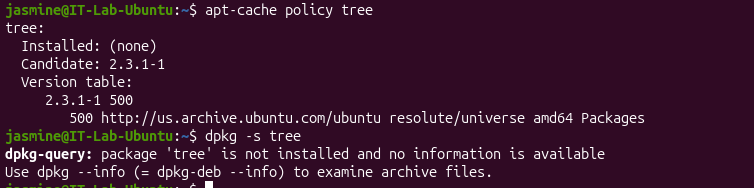
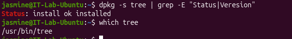

# INC-005 — Linux Software Installation & Troubleshooting

## User Report

User reports that a required application is unavailable on their Linux workstation.

## Impact

One user is unable to use the required application.

## Priority

Medium

## Environment

- Ubuntu Linux
- Oracle VirtualBox
- Linux command line

## Initial Investigation

The following troubleshooting steps will be performed:

1. Verify whether the application is installed.
2. Review package information.
3. Verify the package repository.
4. Install or repair the application.
5. Confirm the application was installed successfully.
6. Launch and test the application.
7. Document the resolution.

## Tools and Commands

```bash
which
dpkg
apt
ps
```

## Findings

### Initial Application Test

The required `tree` utility was tested using:

```bash
tree --version
```

The system returned a command-not-found error, confirming the reported issue.

### Package Investigation

The package was investigated using Ubuntu package-management tools.

```bash
dpkg -s tree
```

The system reported that the `tree` package was not installed.

The configured Ubuntu repositories were then checked using:

```bash
apt-cache policy tree
```

The results showed:

```text
Installed: (none)
Candidate: 2.3.1-1
```

This confirmed that the application was not installed but an installation candidate was available from the configured Ubuntu repository.

## Root Cause

The required `tree` application was not installed on the Linux workstation.

The investigation did not identify a broken installation or unavailable repository. The package was simply missing from the system.

## Resolution

The missing package was installed using the Ubuntu APT package manager:

```bash
sudo apt install tree
```

The installation completed successfully.

## Verification

The installation was verified using:

```bash
dpkg -s tree
which tree
```

The application was then tested using:

```bash
tree --version
```

The command successfully returned version information for `tree` 2.3.1, confirming that the application was installed and operational.

## Evidence

### Initial Command Failure


### Package Investigation



### Package Installation Verification



### Application Verification


## Skills Demonstrated

- Linux software troubleshooting
- Ubuntu package management
- APT package installation
- Package repository investigation
- Software installation verification
- Linux command-line administration
- Root cause analysis
- Help desk troubleshooting
- Technical documentation
- Resolution verification

## Status

Resolved