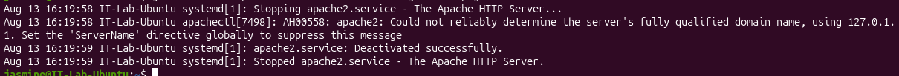

# INC-006 — Linux Service Troubleshooting

## User Report

User reports that a required network service is unavailable on their Linux workstation.

## Impact

The user is unable to access the service required for their work.

## Priority

Medium

## Environment

- Ubuntu Linux virtual machine
- Oracle VirtualBox
- Linux command line

## Initial Investigation

The following troubleshooting steps will be performed:

1. Verify whether the required service is installed.
2. Check the current service status.
3. Review service logs.
4. Identify the cause of the service outage.
5. Restore the service.
6. Verify that the service is running.
7. Test access to the service.

## Tools and Commands

```bash
systemctl
journalctl
ps
curl
apt
```

## Findings

### Initial Service Test

The Apache web service was initially verified to be operational. An HTTP request returned:

```text
HTTP/1.1 200 OK
```

This established a known-good baseline before troubleshooting.

### Problem Reproduction

The web service became unavailable and an HTTP request failed with a connection error:

```text
curl: (7) Failed to connect to localhost port 80
```

This reproduced the reported service outage.

### Service Investigation

The Apache service was investigated using:

```bash
systemctl status apache2
```

The service status showed:

```text
Active: inactive (dead)
```

This indicated that Apache was installed but was not currently running.

### Log Investigation

Recent Apache service logs were reviewed using:

```bash
journalctl -u apache2 --since "15 minutes ago" --no-pager
```

The logs showed that the Apache service had been stopped and deactivated successfully.

No evidence of an application crash was identified.

A hostname warning was present in the logs, but it was not responsible for the service outage.

## Root Cause

The Apache web service was stopped.

Because the service was inactive, no process was available to respond to HTTP requests on port 80, resulting in the connection failure.

## Resolution

The Apache service was restored using:

```bash
sudo systemctl start apache2
```

The service status was then checked to confirm that Apache returned to an active running state.

## Verification

Service status was verified using:

```bash
systemctl status apache2
```

The service reported:

```text
Active: active (running)
```

An HTTP request was then performed against the local loopback address:

```bash
curl -I http://127.0.0.1
```

The server returned:

```text
HTTP/1.1 200 OK
```

This confirmed that Apache was running and responding successfully after remediation.

## Evidence

### Service Unavailable


### Apache Service Inactive


### Service Log Investigation



### Apache Service Restored


### HTTP Verification


## Skills Demonstrated

- Linux service administration
- systemd service management
- `systemctl`
- `journalctl`
- Linux log analysis
- HTTP connectivity testing
- `curl`
- Service outage troubleshooting
- Root cause analysis
- Service restoration
- Resolution verification
- Technical documentation

## Status

Resolved