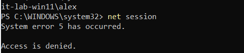
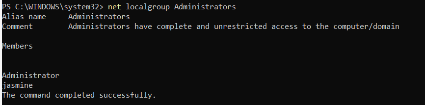
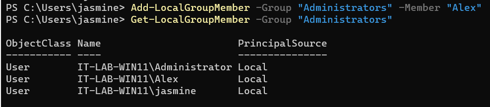
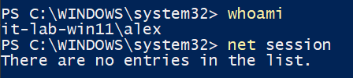

# INC-007 — Windows Local User Account Troubleshooting

## User Report

A user reports that they cannot perform an administrative task on their Windows 11 workstation.

## Impact

The user is unable to perform a task requiring elevated permissions.

## Priority

Medium

## Environment

- Windows 11 Pro
- Oracle VirtualBox
- Windows PowerShell
- Local Windows user accounts

## Initial Investigation

The following troubleshooting steps will be performed:

1. Verify the affected user account.
2. Review local user accounts.
3. Review local group membership.
4. Reproduce the permissions issue.
5. Identify the cause of the access problem.
6. Correct the account configuration.
7. Verify the updated permissions.

## Tools

```powershell
whoami
Get-LocalUser
Get-LocalGroup
Get-LocalGroupMember
Add-LocalGroupMember
```

## Findings

### User Account Verification

The affected account was identified as:

```text
IT-LAB-WIN11\Alex
```

The account was confirmed to be enabled and configured with a required password.

### Administrative Access Test

The user attempted to execute an administrative command:

```powershell
net session
```

The command returned:

```text
System error 5 has occurred.

Access is denied.
```

This confirmed that the user did not have sufficient administrative privileges.

### Group Membership Investigation

The local Administrators group was reviewed using:

```powershell
net localgroup Administrators
```

The group contained the following administrative accounts:

```text
Administrator
jasmine
```

The affected user, Alex, was not a member of the Administrators group.

## Root Cause

The Alex local user account was not a member of the Windows local Administrators group.

As a result, the account did not have the permissions required to perform the requested administrative task.

## Resolution

Using an administrator account, Alex was added to the local Administrators group:

```powershell
Add-LocalGroupMember -Group "Administrators" -Member "Alex"
```

Group membership was then verified using:

```powershell
Get-LocalGroupMember -Group "Administrators"
```

Alex appeared as a member of the Administrators group after the change.

## Verification

A new session was started for Alex so that Windows could generate a new security token containing the updated group membership.

An elevated PowerShell session was then opened using User Account Control.

The administrative command was tested again:

```powershell
net session
```

The previous `System error 5 - Access is denied` message was no longer returned, confirming that administrative access had been restored.

## Evidence

### Administrative Access Denied



### User Group Investigation



### Administrator Membership Corrected



### Administrative Access Restored



## Skills Demonstrated

- Windows 11 administration
- Windows PowerShell
- Local user account management
- Local group management
- Windows permissions troubleshooting
- `Get-LocalUser`
- `Get-LocalGroupMember`
- `Add-LocalGroupMember`
- `whoami`
- `net user`
- `net localgroup`
- User Account Control (UAC)
- Windows security tokens
- Root cause analysis
- Incident documentation
- Resolution verification

## Status

Resolved