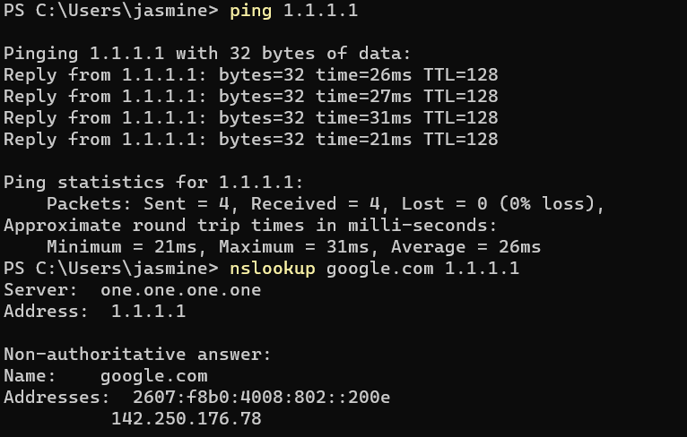
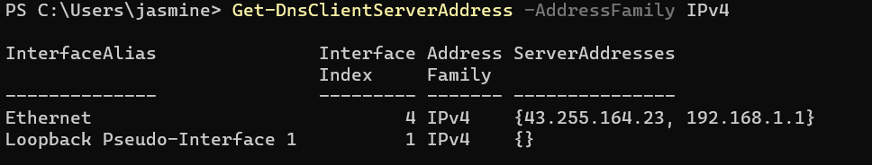
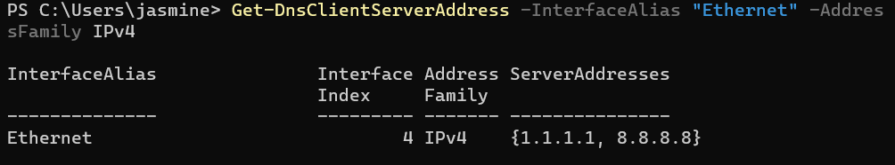
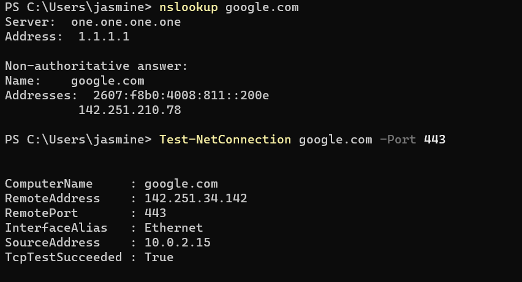

# INC-008 — Windows Network and DNS Troubleshooting

## User Report

A user reports that websites are not loading correctly on their Windows 11 workstation.

## Impact

One user is unable to reliably access Internet resources.

## Priority

Medium

## Environment

- Windows 11 Pro
- Oracle VirtualBox
- Windows PowerShell
- VirtualBox network adapter

## Initial Investigation

The following troubleshooting steps will be performed:

1. Review the workstation's IP configuration.
2. Verify local TCP/IP functionality.
3. Test connectivity to an external IP address.
4. Test connectivity using a domain name.
5. Test DNS resolution.
6. Review DNS cache information.
7. Clear the DNS cache.
8. Verify connectivity after troubleshooting.

## Tools and Commands

```powershell
ipconfig /all
ping
nslookup
Test-NetConnection
ipconfig /displaydns
ipconfig /flushdns

## Findings

### Initial Connectivity Testing

External network connectivity was tested to determine whether the workstation had general Internet access.

```powershell
ping 1.1.1.1
```

The test completed successfully with:

```text
Packets: Sent = 4, Received = 4, Lost = 0 (0% loss)
```

This confirmed that basic IP connectivity was operational.

### DNS Resolution Failure

DNS resolution was tested using:

```powershell
nslookup google.com
```

The configured DNS resolver returned repeated timeout errors:

```text
DNS request timed out.
Server: Unknown
Address: 43.255.164.23
```

This indicated a DNS-specific problem rather than a complete loss of network connectivity.

### Alternate DNS Testing

A DNS query was sent directly to Cloudflare's public DNS resolver:

```powershell
nslookup google.com 1.1.1.1
```

The query successfully resolved `google.com`.

This demonstrated that:

- External network connectivity was available.
- DNS queries could reach an alternate resolver.
- The problem was isolated to the DNS server configured on the workstation.

### DNS Configuration Investigation

The workstation's IPv4 DNS configuration was reviewed using:

```powershell
Get-DnsClientServerAddress -AddressFamily IPv4
```

The Ethernet adapter was configured to use:

```text
43.255.164.23
```

This was the resolver that had timed out during the original DNS test.

## Root Cause

The Windows workstation was configured to use a DNS resolver that was not responding to DNS queries.

General Internet connectivity remained available, but hostname resolution through the configured DNS server failed.

## Resolution

The Ethernet adapter's DNS configuration was changed to use alternate public DNS resolvers:

```powershell
Set-DnsClientServerAddress -InterfaceAlias "Ethernet" -ServerAddresses ("1.1.1.1","8.8.8.8")
```

The new configuration was verified using:

```powershell
Get-DnsClientServerAddress -InterfaceAlias "Ethernet" -AddressFamily IPv4
```

The configured DNS servers were confirmed as:

```text
1.1.1.1
8.8.8.8
```

The Windows DNS resolver cache was then cleared:

```powershell
ipconfig /flushdns
```

Windows reported that the DNS Resolver Cache was successfully flushed.

## Verification

The original DNS test was repeated without manually specifying a DNS server:

```powershell
nslookup google.com
```

Windows automatically used:

```text
Server: one.one.one.one
Address: 1.1.1.1
```

The query successfully resolved `google.com`.

HTTPS connectivity was then verified using:

```powershell
Test-NetConnection google.com -Port 443
```

The test returned:

```text
TcpTestSucceeded : True
```

This confirmed that DNS resolution and HTTPS connectivity were functioning after remediation.

## Evidence

### DNS Resolution Failure


### Alternate DNS Test



### Original DNS Configuration



### Corrected DNS Configuration



### DNS Cache Cleared


### Connectivity Verified



## Skills Demonstrated

- Windows 11 network troubleshooting
- DNS troubleshooting
- TCP/IP diagnostics
- PowerShell networking commands
- `ping`
- `nslookup`
- `Test-NetConnection`
- `Get-DnsClientServerAddress`
- `Set-DnsClientServerAddress`
- `ipconfig`
- DNS cache management
- Network problem isolation
- Root cause analysis
- Connectivity verification
- Technical documentation

## Status

Resolved