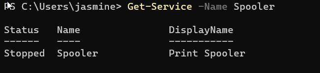
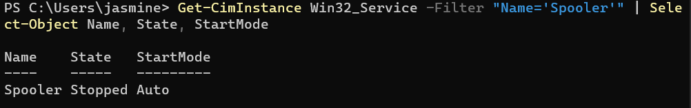
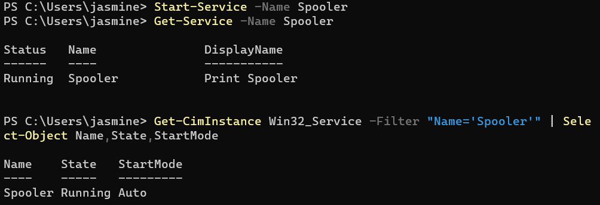

# INC-009 — Windows Print Spooler Service Troubleshooting

## User Report

A user reports that printing is unavailable from their Windows 11 workstation.

## Impact

The user is unable to print documents.

## Priority

Medium

## Environment

- Windows 11 Pro
- Oracle VirtualBox
- Windows PowerShell
- Windows Print Spooler service

## Initial Investigation

The following troubleshooting steps will be performed:

1. Verify the Print Spooler service exists.
2. Determine the current service status.
3. Reproduce the service failure.
4. Review Windows event logs.
5. Identify the cause of the printing issue.
6. Restore the Print Spooler service.
7. Verify the service is operational.

## Tools and Commands

```powershell
Get-Service
Stop-Service
Start-Service
Get-WinEvent
sc.exe
```

## Findings

### Print Spooler Status

The Windows Print Spooler service was investigated after the user reported being unable to print.

The service status was checked using:

```powershell
Get-Service -Name Spooler
```

The service returned:

```text
Status   Name      DisplayName
------   ----      -----------
Stopped  Spooler   Print Spooler
```

This confirmed that the Print Spooler service was not running.

### Service Configuration Investigation

The Print Spooler configuration was examined using:

```powershell
Get-CimInstance Win32_Service -Filter "Name='Spooler'" | Select-Object Name,State,StartMode
```

The service showed:

```text
Name     State     StartMode
----     -----     ---------
Spooler  Stopped   Auto
```

The service was configured to start automatically but was currently stopped.

### Event Log Investigation

The Windows System event log was reviewed for recent Service Control Manager events.

The investigation was performed using `Get-WinEvent`, including filtering for events containing references to the Print Spooler.

No relevant recent Print Spooler events were found in the reviewed System log entries.

Because no corresponding error event was identified, the investigation did not attribute the stopped service to a specific Windows service failure.

## Root Cause

The immediate cause of the printing issue was that the Windows Print Spooler service was stopped.

The service remained configured with an Automatic startup type, but it was not running when the incident was investigated.

No relevant recent System event was identified that established why the service had stopped.

## Resolution

The Print Spooler service was restarted using:

```powershell
Start-Service -Name Spooler
```

The service status was then checked using:

```powershell
Get-Service -Name Spooler
```

The service returned to the `Running` state.

## Verification

The service configuration and operating state were verified using:

```powershell
Get-CimInstance Win32_Service -Filter "Name='Spooler'" | Select-Object Name,State,StartMode
```

The final result showed:

```text
Name     State     StartMode
----     -----     ---------
Spooler  Running   Auto
```

This confirmed that the Print Spooler was running and remained configured for automatic startup.

## Evidence

### Print Spooler Stopped



### Service Investigation



### Service Restored and Verified



## Skills Demonstrated

- Windows 11 troubleshooting
- Windows service management
- Windows PowerShell
- Print Spooler troubleshooting
- Windows System event log investigation
- Service Control Manager investigation
- `Get-Service`
- `Start-Service`
- `Stop-Service`
- `Get-CimInstance`
- `Get-WinEvent`
- Service startup configuration
- Incident troubleshooting
- Root cause analysis
- Resolution verification
- Technical documentation

## Status

Resolved