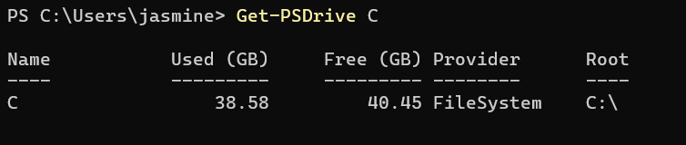
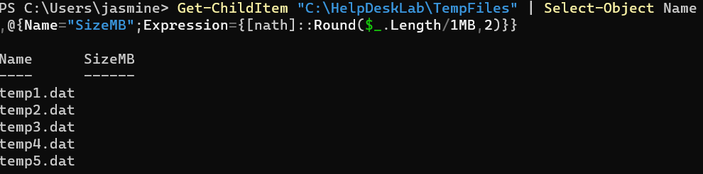
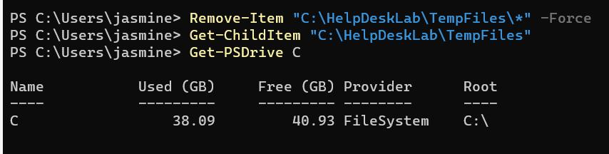

# INC-010 — Windows Low Disk Space Troubleshooting

## User Report

A user reports that their Windows 11 workstation is running low on storage space and performance has become slower.

## Impact

Low available disk space may affect system performance, application operation, and Windows updates.

## Priority

Medium

## Environment

- Windows 11 Pro
- Oracle VirtualBox
- Windows PowerShell
- NTFS system volume

## Initial Investigation

1. Check available disk space.
2. Identify the affected system volume.
3. Investigate disk usage.
4. Identify unnecessary temporary files.
5. Remove safe temporary data.
6. Verify recovered storage space.

## Tools and Commands

```powershell
Get-Volume
Get-PSDrive
Get-ChildItem
Measure-Object
Remove-Item
```

## Findings

### Disk Space Investigation

The system drive was reviewed using:

```powershell
Get-PSDrive C
```

This established the available storage before cleanup.

### Temporary File Investigation

A temporary file directory was reviewed using:

```powershell
Get-ChildItem "C:\HelpDeskLab\TempFiles"
```

Five temporary files were identified.

Each file was approximately 100 MB, for a total of approximately 500 MB of unnecessary data.

### Storage Impact

The temporary files were identified as safe lab-generated files that were no longer required.

## Root Cause

The simulated storage issue was caused by approximately 500 MB of unnecessary temporary data stored in:

```text
C:\HelpDeskLab\TempFiles
```

## Resolution

The unnecessary temporary files were removed using:

```powershell
Remove-Item "C:\HelpDeskLab\TempFiles\*" -Force
```

The directory was then checked again to confirm that the files had been removed.

## Verification

File removal was verified using:

```powershell
Test-Path "C:\HelpDeskLab\TempFiles\temp1.dat"
```

The command returned:

```text
False
```

This confirmed that the temporary file no longer existed.

Available storage was checked again using:

```powershell
Get-PSDrive C
```

and:

```powershell
[math]::Round((Get-Volume -DriveLetter C).SizeRemaining / 1GB, 2)
```

The system reported approximately:

```text
40.93 GB
```

of free space after cleanup.

The C: volume was also verified as:

```text
FileSystemType: NTFS
DriveType: Fixed
HealthStatus: Healthy
OperationalStatus: OK
```

## Evidence

### Disk Space Before Cleanup



### Temporary Files Identified



### Cleanup Completed



### Cleanup Verified


## Skills Demonstrated

- Windows 11 storage troubleshooting
- PowerShell
- Disk-space analysis
- File-system investigation
- Temporary file identification
- Safe file cleanup
- `Get-PSDrive`
- `Get-Volume`
- `Get-ChildItem`
- `Measure-Object`
- `Remove-Item`
- `Test-Path`
- Storage verification
- Root cause analysis
- Technical documentation

## Status

Resolved