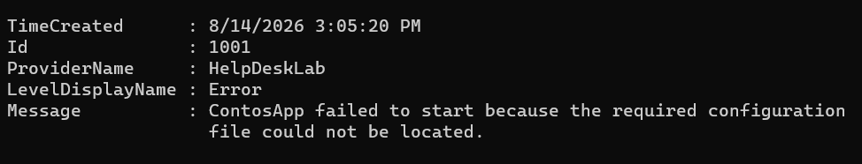
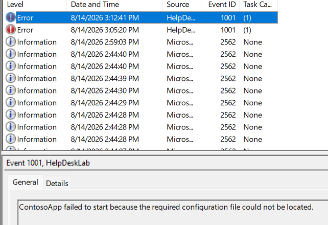
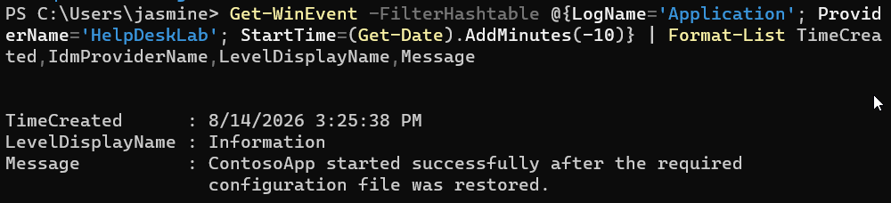
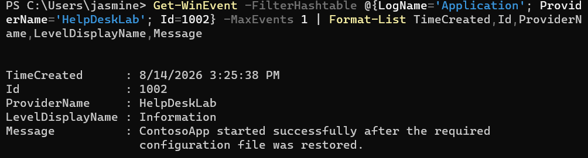

# INC-011 — Windows Application Event Log Troubleshooting

## User Report

A user reports that an application on their Windows 11 workstation is failing during use.

## Impact

The user is unable to reliably use the affected application.

## Priority

Medium

## Environment

- Windows 11 Pro
- Oracle VirtualBox
- Windows PowerShell
- Windows Event Viewer

## Initial Investigation

1. Reproduce the reported application problem.
2. Verify the affected application/process.
3. Review Windows Application event logs.
4. Filter events based on time and severity.
5. Identify relevant event information.
6. Determine the cause of the issue.
7. Perform remediation.
8. Verify application functionality.

## Tools and Commands

```powershell
Get-Process
Get-WinEvent
Get-EventLog
```

## Findings

### Application Error Investigation

The Windows Application event log was reviewed after the user reported that ContosoApp would not start.

Recent application events were investigated using PowerShell:

```powershell
Get-WinEvent -FilterHashtable @{LogName='Application'; ProviderName='HelpDeskLab'; StartTime=(Get-Date).AddMinutes(-10)}
```

An application error was identified with the following information:

```text
Event ID: 1001
Provider: HelpDeskLab
Level: Error
```

The event message reported that ContosoApp failed to start because a required configuration file could not be located.

### Event Viewer Investigation

Windows Event Viewer was also used to review the Application log.

The HelpDeskLab event was located under:

```text
Windows Logs > Application
```

The event information confirmed the application failure identified through PowerShell.

### Configuration Investigation

Based on the event message, the required application configuration file was investigated.

The expected configuration location was:

```text
C:\ContosoApp\config.ini
```

The required configuration file was restored.

## Root Cause

ContosoApp was unable to start because its required `config.ini` configuration file was missing.

Windows Application event log analysis identified the missing configuration file as the cause of the simulated application failure.

## Resolution

The required application directory and configuration file were restored.

```powershell
New-Item -Path "C:\ContosoApp" -ItemType Directory -Force
New-Item -Path "C:\ContosoApp\config.ini" -ItemType File -Force
```

The file was verified using:

```powershell
Test-Path "C:\ContosoApp\config.ini"
```

The command returned:

```text
True
```

confirming that the required configuration file existed.

## Verification

A successful application startup event was recorded after remediation.

The event was verified using:

```powershell
Get-WinEvent -FilterHashtable @{LogName='Application'; ProviderName='HelpDeskLab'; Id=1002} -MaxEvents 1 | Format-List TimeCreated,Id,ProviderName,LevelDisplayName,Message
```

The resulting event showed:

```text
Event ID: 1002
Provider: HelpDeskLab
Level: Information
Message: ContosoApp started successfully after the required configuration file was restored.
```

This confirmed successful completion of the simulated remediation and verification process.

## Evidence

### Application Error Identified



### Event Viewer Investigation



### Configuration File Restored


### Application Resolution



### Success Event Verified



## Skills Demonstrated

- Windows 11 troubleshooting
- Windows Event Viewer
- Windows Application event logs
- PowerShell
- `Get-WinEvent`
- Event log filtering
- Event ID analysis
- Application troubleshooting
- Configuration-file troubleshooting
- `Test-Path`
- `New-Item`
- Incident investigation
- Root cause analysis
- Resolution verification
- Technical documentation

## Status

Resolved