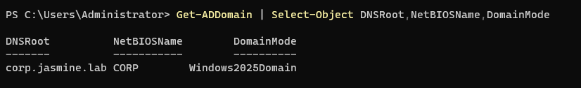
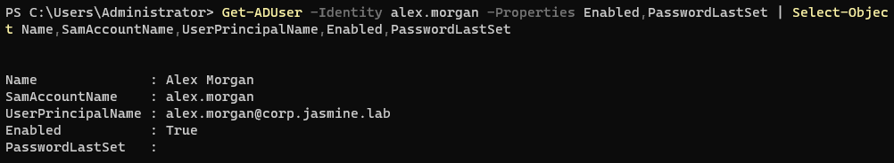
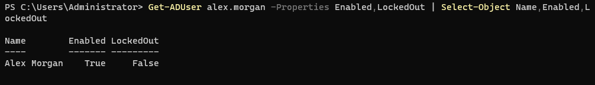
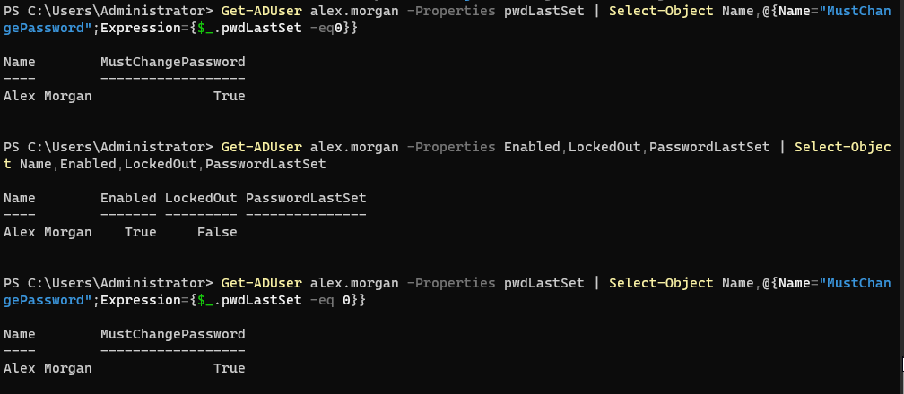
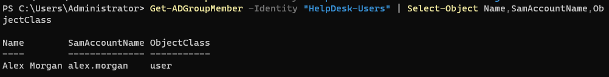
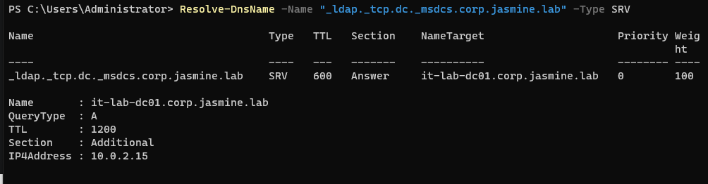
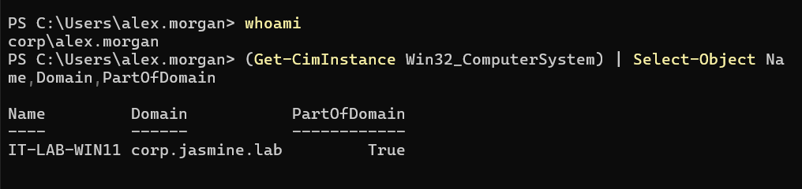
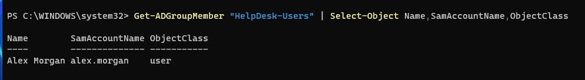

# INC-012 — Active Directory User and Workstation Support

## Ticket Summary

A Windows 11 workstation needed to be integrated into a newly configured Active Directory environment. The task included configuring Active Directory Domain Services, DNS, user and group administration, workstation networking, domain authentication, and troubleshooting domain-join failures.

## Environment

- Windows Server 2025
- Windows 11 Professional
- Active Directory Domain Services (AD DS)
- DNS
- PowerShell
- VirtualBox
- Domain: corp.jasmine.lab
- Domain Controller: IT-LAB-DC01
- Domain Controller IP: 10.0.2.15
- Workstation: IT-LAB-WIN11
- Workstation IP: 10.0.2.20

## User Impact

The Windows 11 workstation could communicate with the domain controller but initially could not join the Active Directory domain. Until resolved, domain users could not authenticate to the workstation or access domain-managed resources.

## Troubleshooting Performed

1. Installed and configured Active Directory Domain Services on Windows Server 2025.
2. Promoted IT-LAB-DC01 to a domain controller for corp.jasmine.lab.
3. Verified the Active Directory domain and DNS configuration.
4. Created the Alex Morgan domain user account.
5. Created and configured the HelpDesk-Users security group.
6. Added Alex Morgan to HelpDesk-Users.
7. Configured the Windows 11 workstation with a static IPv4 address.
8. Configured the workstation to use the domain controller as its DNS server.
9. Verified network connectivity between IT-LAB-WIN11 and IT-LAB-DC01.
10. Verified Active Directory DNS SRV records.
11. Used `nltest` to confirm that the workstation could locate the domain controller.
12. Tested required services including DNS, Kerberos, RPC, LDAP, and SMB.
13. Verified time synchronization between the workstation and domain controller.
14. Verified NETLOGON and SYSVOL shares on the domain controller.
15. Tested domain Administrator authentication from the Windows 11 workstation.
16. Investigated failed PowerShell domain-join attempts.
17. Verified the domain Administrator account was enabled and not locked out.
18. Verified the Windows 11 workstation was running Windows 11 Professional and supported Active Directory domain joins.
19. Successfully joined IT-LAB-WIN11 to corp.jasmine.lab using Windows System Properties.
20. Restarted the workstation and authenticated using the CORP\alex.morgan domain account.
21. Verified the workstation reported `PartOfDomain` as `True`.
22. Verified the domain user, security group membership, and computer object from Active Directory.

## Resolution

The Windows 11 Professional workstation was successfully joined to the `corp.jasmine.lab` Active Directory domain.

After troubleshooting DNS, network connectivity, authentication, required Active Directory services, and domain controller discovery, the workstation was successfully joined through Windows System Properties.

The domain user `CORP\alex.morgan` successfully authenticated to the workstation. The workstation reported `corp.jasmine.lab` as its domain and confirmed that it was an Active Directory domain member.

## Verification

The following commands were used throughout troubleshooting and verification:

```powershell
Resolve-DnsName -Name "_ldap._tcp.dc._msdcs.corp.jasmine.lab" -Type SRV

nltest /dsgetdc:corp.jasmine.lab

Test-NetConnection 10.0.2.15 -Port 53
Test-NetConnection 10.0.2.15 -Port 88
Test-NetConnection 10.0.2.15 -Port 135
Test-NetConnection 10.0.2.15 -Port 389
Test-NetConnection 10.0.2.15 -Port 445

w32tm /stripchart /computer:10.0.2.15 /samples:3 /dataonly

whoami

(Get-CimInstance Win32_ComputerSystem) |
    Select-Object Name,Domain,PartOfDomain

Get-ADComputer "IT-LAB-WIN11"

Get-ADUser "alex.morgan"

Get-ADGroupMember "HelpDesk-Users"
```

Successful verification confirmed:

- Active Directory DNS records resolved correctly.
- IT-LAB-WIN11 could discover IT-LAB-DC01.
- DNS connectivity was operational.
- Kerberos connectivity was operational.
- RPC connectivity was operational.
- LDAP connectivity was operational.
- SMB connectivity was operational.
- Workstation and domain controller time synchronization was within acceptable limits.
- NETLOGON and SYSVOL were available on the domain controller.
- Domain Administrator credentials successfully authenticated against the domain controller.
- IT-LAB-WIN11 successfully joined corp.jasmine.lab.
- CORP\alex.morgan successfully authenticated to the domain-joined workstation.
- IT-LAB-WIN11 reported `PartOfDomain` as `True`.
- Alex Morgan was successfully configured as an Active Directory user.

## Skills Demonstrated

- Active Directory Domain Services (AD DS)
- Windows Server administration
- Active Directory user administration
- Active Directory computer administration
- Security group management
- Windows domain joins
- DNS configuration and troubleshooting
- Active Directory DNS SRV records
- TCP/IP configuration
- PowerShell
- LDAP troubleshooting
- Kerberos troubleshooting
- RPC and SMB connectivity testing
- Domain controller discovery
- SYSVOL and NETLOGON verification
- Authentication troubleshooting
- Windows 11 administration
- VirtualBox networking
- Structured help desk troubleshooting
- Technical documentation

## Outcome

The Active Directory environment was successfully configured and validated. A Windows 11 Professional workstation was joined to the domain, and a domain user successfully authenticated to the workstation.

The troubleshooting process demonstrated the ability to isolate Active Directory problems by systematically testing DNS, network connectivity, authentication, domain controller discovery, required services, computer accounts, and client configuration before implementing the final resolution.

## Screenshots

### Active Directory Domain Created


### Domain User Created


### Initial Account Status


### Password Reset Verified


### Security Group Membership


### Active Directory DNS SRV Record


### Domain Login Verified


### Final Active Directory Verification
