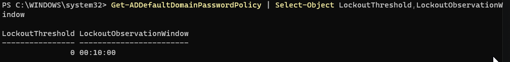
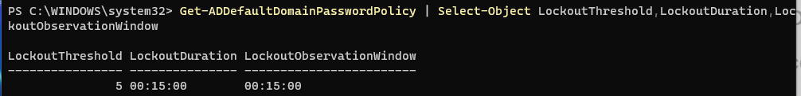
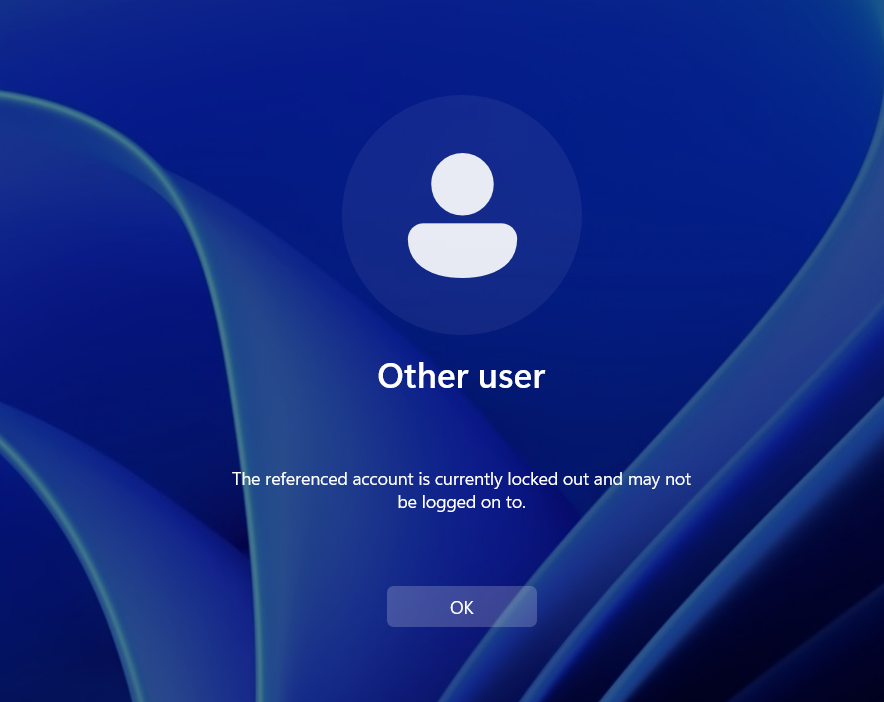
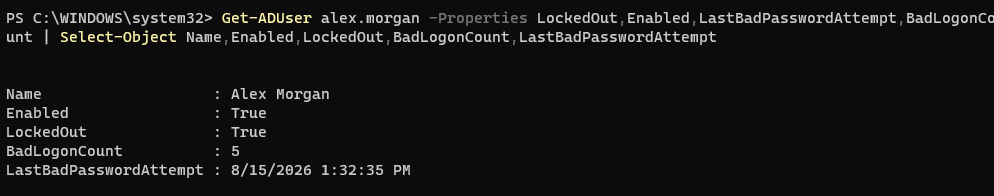
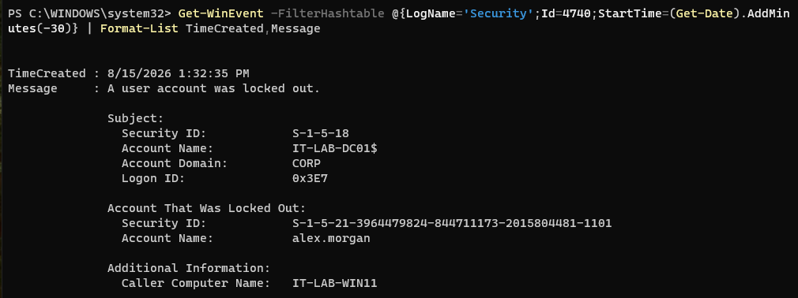
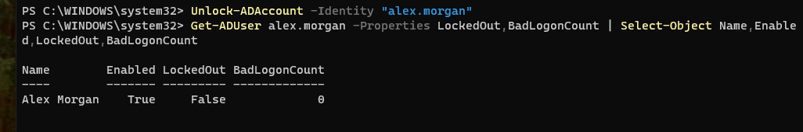
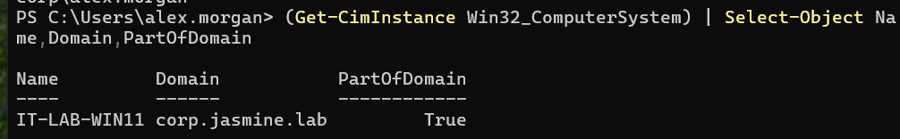
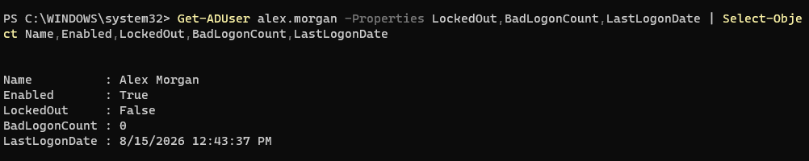

# INC-013 — Active Directory Account Lockout Troubleshooting

## Ticket Summary

A domain user reported being unable to sign in to a Windows 11 workstation after multiple unsuccessful authentication attempts. Investigation determined that the Active Directory account had been locked after reaching the domain's configured account lockout threshold.

The account lockout was investigated from the domain controller, the originating workstation was identified through the Windows Security event log, the account was unlocked, and successful domain authentication was verified.

## Environment

- Windows Server 2025
- Windows 11 Professional
- Active Directory Domain Services (AD DS)
- PowerShell
- Windows Event Viewer / Security Event Log
- Domain: corp.jasmine.lab
- Domain Controller: IT-LAB-DC01
- Workstation: IT-LAB-WIN11
- User: Alex Morgan
- User Account: alex.morgan

## User Impact

Alex Morgan was unable to authenticate to the domain-joined Windows 11 workstation after multiple incorrect password attempts.

The account remained enabled in Active Directory but was placed into a locked state, preventing successful domain authentication.

## Initial Investigation

The Active Directory domain password policy was reviewed using:

```powershell
Get-ADDefaultDomainPasswordPolicy | Select-Object LockoutThreshold,LockoutDuration,LockoutObservationWindow
```

The initial lockout threshold was:

```text
LockoutThreshold : 0
```

This indicated that automatic account lockouts were not currently configured.

For the lab environment, the domain policy was configured with:

- Lockout threshold: 5 failed attempts
- Lockout duration: 15 minutes
- Observation window: 15 minutes

The policy was configured using:

```powershell
Set-ADDefaultDomainPasswordPolicy -Identity "corp.jasmine.lab" -LockoutThreshold 5 -LockoutDuration "00:15:00" -LockoutObservationWindow "00:15:00"
```

## Issue Reproduction

Five incorrect authentication attempts were generated for:

```text
CORP\alex.morgan
```

from the domain-joined workstation:

```text
IT-LAB-WIN11
```

After the fifth unsuccessful attempt, the user was unable to authenticate.

## Account Investigation

The account status was checked from IT-LAB-DC01 using:

```powershell
Get-ADUser alex.morgan -Properties LockedOut,Enabled,LastBadPasswordAttempt,BadLogonCount | Select-Object Name,Enabled,LockedOut,BadLogonCount,LastBadPasswordAttempt
```

The investigation confirmed:

```text
Name          : Alex Morgan
Enabled       : True
LockedOut     : True
BadLogonCount : 5
```

This confirmed that the account was enabled but had been locked after reaching the configured authentication-failure threshold.

## Security Event Investigation

The Windows Security log on the domain controller was searched for Active Directory account lockout events using Event ID 4740:

```powershell
Get-WinEvent -FilterHashtable @{LogName='Security';Id=4740;StartTime=(Get-Date).AddMinutes(-30)} | Format-List TimeCreated,Message
```

The security event confirmed:

```text
Account Name: alex.morgan
Caller Computer Name: IT-LAB-WIN11
```

This identified IT-LAB-WIN11 as the workstation responsible for the authentication attempts that triggered the account lockout.

## Resolution

Because the account was enabled and the issue was confirmed to be an account lockout, the account was unlocked without unnecessarily resetting the user's password.

The following command was used:

```powershell
Unlock-ADAccount -Identity "alex.morgan"
```

The account status was then verified:

```powershell
Get-ADUser alex.morgan -Properties LockedOut,BadLogonCount | Select-Object Name,Enabled,LockedOut,BadLogonCount
```

Verification confirmed that the account was enabled and no longer locked.

## User Verification

The user returned to IT-LAB-WIN11 and successfully authenticated using the existing domain credentials.

The logged-in identity was verified using:

```powershell
whoami
```

Result:

```text
corp\alex.morgan
```

Domain membership was verified using:

```powershell
(Get-CimInstance Win32_ComputerSystem) | Select-Object Name,Domain,PartOfDomain
```

The workstation reported:

```text
Name          Domain             PartOfDomain
IT-LAB-WIN11  corp.jasmine.lab   True
```

## Final Verification

A final Active Directory account check confirmed that Alex Morgan's account remained enabled and unlocked after successful authentication.

```powershell
Get-ADUser alex.morgan -Properties LockedOut,BadLogonCount,LastLogonDate | Select-Object Name,Enabled,LockedOut,BadLogonCount,LastLogonDate
```

Final verification confirmed:

- User account enabled
- Account no longer locked
- Successful domain authentication
- Workstation remained joined to corp.jasmine.lab

## Root Cause

The user account reached the Active Directory account lockout threshold after five unsuccessful password attempts from IT-LAB-WIN11.

Windows Security Event ID 4740 identified the originating workstation, allowing the source of the lockout to be confirmed before remediation.

## Resolution Summary

**Issue:** Domain user unable to authenticate.

**Cause:** Active Directory account locked after five unsuccessful authentication attempts.

**Source:** IT-LAB-WIN11.

**Resolution:** Confirmed account status, investigated Security Event ID 4740, unlocked the Active Directory account, and verified successful user authentication.

## Skills Demonstrated

- Active Directory account troubleshooting
- Account lockout investigation
- Active Directory password policy administration
- PowerShell
- Windows Security event log analysis
- Event ID 4740 investigation
- Failed authentication troubleshooting
- Workstation identification
- Active Directory user administration
- Domain authentication verification
- Root-cause analysis
- Help desk incident documentation

## Screenshots

### Initial Account Lockout Policy
The domain initially had no automatic account lockout threshold configured.



### Account Lockout Policy Configured
The domain was configured to lock an account after five unsuccessful authentication attempts.



### User Login Failure
Repeated invalid credentials from the Windows 11 workstation triggered the account lockout policy.



### Account Lockout Detected
Active Directory confirmed that Alex Morgan's account was enabled but locked after five failed authentication attempts.



### Security Event 4740
The domain controller's Security log identified the account lockout and showed IT-LAB-WIN11 as the caller computer.



### Account Unlocked
The account was unlocked and Active Directory confirmed that the user was no longer in a locked state.



### Successful Login After Unlock
Alex Morgan successfully authenticated to the domain workstation after the account was unlocked.



### Final Account Verification
A final Active Directory check confirmed that the account remained enabled and unlocked following successful authentication.

