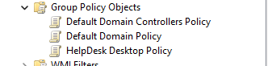
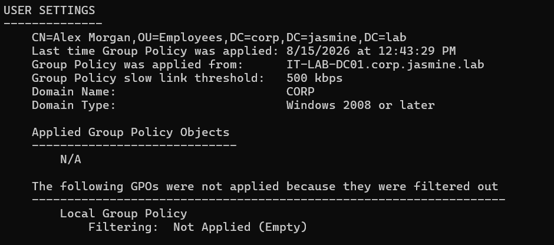
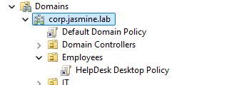
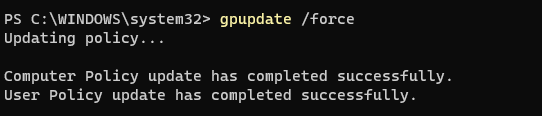
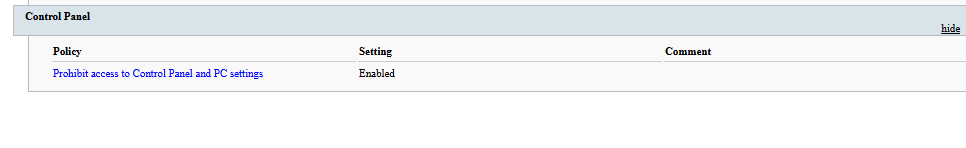
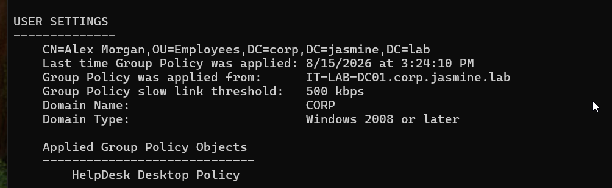
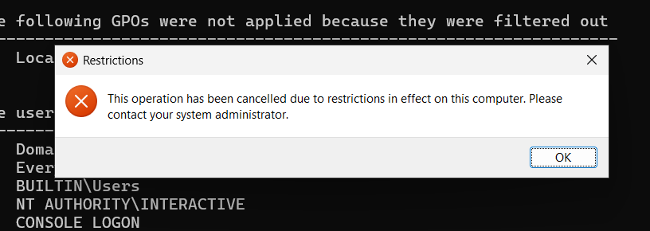
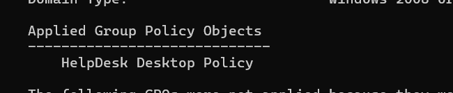

# INC-014 — Active Directory Group Policy Troubleshooting

## Ticket Summary

A domain user reported that a required workstation restriction was not being applied. A Group Policy Object (GPO) existed in Active Directory but initially was not being applied to the user's session.

The issue was investigated by validating the user's Active Directory location, GPO configuration, OU linkage, security filtering, Group Policy processing, SYSVOL accessibility, and client-side policy application.

The policy was successfully applied and enforcement was verified on the Windows 11 workstation.

## Environment

- Windows Server 2025
- Windows 11 Professional
- Active Directory Domain Services (AD DS)
- Group Policy Management
- PowerShell
- Windows Event Viewer
- SYSVOL
- Domain: corp.jasmine.lab
- Domain Controller: IT-LAB-DC01
- Workstation: IT-LAB-WIN11
- User: Alex Morgan
- User Account: alex.morgan
- Organizational Unit: Employees

## User Impact

The required domain policy was not initially being applied to the user's Windows 11 session.

Group Policy Results initially reported:

```text
Applied Group Policy Objects
----------------------------
N/A
```

This indicated that the expected domain user policy was not being applied.

## Initial Investigation

A new Group Policy Object named:

```text
HelpDesk Desktop Policy
```

was created in Group Policy Management.

The GPO was configured with the following user policy:

```text
User Configuration
→ Policies
→ Administrative Templates
→ Control Panel
→ Prohibit access to Control Panel and PC settings
```

The policy setting was configured as:

```text
Enabled
```

The GPO initially existed without being linked to the user's Organizational Unit, reproducing a scenario where an administrator creates a policy but the intended user does not receive it.

## User Location Verification

The user's Active Directory Distinguished Name was retrieved using:

```powershell
Get-ADUser alex.morgan -Properties DistinguishedName | Format-List Name,DistinguishedName
```

The result confirmed:

```text
Name              : Alex Morgan
DistinguishedName : CN=Alex Morgan,OU=Employees,DC=corp,DC=jasmine,DC=lab
```

This established that the user account was located in the **Employees OU**.

## GPO Link Configuration

The HelpDesk Desktop Policy was linked to:

```text
OU=Employees,DC=corp,DC=jasmine,DC=lab
```

The GPO inheritance and link configuration were verified using:

```powershell
Get-GPInheritance -Target "OU=Employees,DC=corp,DC=jasmine,DC=lab"
```

The output confirmed that:

```text
HelpDesk Desktop Policy
```

was linked to the Employees OU.

The link status was also verified and confirmed to be enabled.

## Security Filtering Investigation

GPO permissions were examined using:

```powershell
Get-GPPermission -Name "HelpDesk Desktop Policy" -All | ForEach-Object { "$($_.Trustee.Name) - $($_.Permission)" }
```

The results included:

```text
Authenticated Users - GpoApply
```

This confirmed that authenticated domain users had permission to read and apply the policy.

Security filtering was therefore ruled out as the cause of the policy application issue.

## GPO Configuration Verification

The GPO configuration was exported to an HTML report using:

```powershell
Get-GPOReport -Name "HelpDesk Desktop Policy" -ReportType Html -Path "C:\HelpDeskPolicyReport.html"
```

The report confirmed:

```text
Prohibit access to Control Panel and PC settings
Setting: Enabled
```

The overall GPO status was also checked using:

```powershell
Get-GPO -Name "HelpDesk Desktop Policy" | Format-List DisplayName,GpoStatus
```

The result confirmed:

```text
DisplayName : HelpDesk Desktop Policy
GpoStatus   : AllSettingsEnabled
```

This established that the user portion of the GPO was enabled and properly configured.

## Client-Side Group Policy Investigation

Group Policy was manually refreshed on IT-LAB-WIN11 using:

```powershell
gpupdate /force
```

Group Policy Results were then examined using:

```powershell
gpresult /r
```

During initial testing, the user section reported:

```text
Applied Group Policy Objects
----------------------------
N/A
```

This showed that the GPO had not yet entered the active user policy set.

## Group Policy Operational Log Investigation

The Group Policy Operational log on IT-LAB-WIN11 was reviewed using:

```powershell
Get-WinEvent -LogName "Microsoft-Windows-GroupPolicy/Operational" -MaxEvents 30 | Select-Object TimeCreated,Id,LevelDisplayName,Message
```

The events confirmed that the workstation was:

- Discovering the domain controller
- Connecting to Active Directory
- Downloading policies
- Processing Group Policy

Event ID 5313 was further examined using:

```powershell
Get-WinEvent -FilterHashtable @{LogName='Microsoft-Windows-GroupPolicy/Operational';Id=5313} -MaxEvents 5 | Format-List TimeCreated,Message
```

The filtered policy list only identified:

```text
Local Group Policy
Not Applied (Empty)
```

The HelpDesk Desktop Policy was not identified as being rejected by security or scope filtering.

## SYSVOL Investigation

The workstation's ability to access Group Policy files from SYSVOL was tested using:

```powershell
dir \\corp.jasmine.lab\SYSVOL\corp.jasmine.lab\Policies
```

The HelpDesk Desktop Policy GUID was retrieved from the domain controller using:

```powershell
(Get-GPO -Name "HelpDesk Desktop Policy").Id
```

The GPO GUID was:

```text
62eb486f-89ac-4df2-b96c-49e6bfcb2f71
```

A matching policy directory was confirmed in SYSVOL.

The workstation was also able to read the GPO's `GPT.INI` file:

```powershell
Get-Content "\\corp.jasmine.lab\SYSVOL\corp.jasmine.lab\Policies\{62EB486F-89AC-4DF2-B96C-49E6BFCB2F71}\GPT.INI"
```

The policy version returned:

```text
Version=65536
```

This confirmed that the client could access the Group Policy Template stored in SYSVOL.

## Resolution

After confirming:

- Correct Active Directory user location
- Correct GPO configuration
- Correct OU linkage
- Enabled GPO link
- Valid security filtering
- Successful domain controller communication
- Accessible SYSVOL policy files

the user was completely signed out of the existing Windows session and signed back into the domain.

Group Policy was refreshed again using:

```powershell
gpupdate /force
```

Group Policy Results subsequently confirmed that the intended policy was being processed for the user.

## Policy Enforcement Verification

The configured restriction was tested from IT-LAB-WIN11 by attempting to launch Control Panel.

Windows displayed:

```text
This operation has been cancelled due to restrictions in effect on this computer.
Please contact your system administrator.
```

This confirmed that the **Prohibit access to Control Panel and PC settings** policy was successfully enforced.

Final Group Policy results were reviewed using:

```powershell
gpresult /scope user /v
```

The HelpDesk Desktop Policy appeared in the user's applied Group Policy results.

## Root Cause

The GPO initially existed without being linked to the Organizational Unit containing the affected user.

After the GPO was configured and linked to the Employees OU, the existing user session did not immediately reflect the expected policy application during initial testing.

A complete user sign-out/sign-in cycle followed by Group Policy refresh allowed the updated user policy scope to be processed successfully.

## Resolution Summary

**Issue:** Required user Group Policy was not being applied.

**Affected User:** Alex Morgan

**Affected Workstation:** IT-LAB-WIN11

**GPO:** HelpDesk Desktop Policy

**Initial Cause:** GPO was not linked to the Organizational Unit containing the affected user.

**Troubleshooting:** Verified user OU membership, GPO linkage, security filtering, GPO configuration, Group Policy Operational events, domain controller communication, and SYSVOL accessibility.

**Resolution:** Linked the GPO to the Employees OU, refreshed Group Policy, refreshed the user's domain session, and verified successful policy enforcement.

**Verification:** Control Panel access was successfully blocked by the configured domain policy.

## Skills Demonstrated

- Active Directory administration
- Group Policy Management
- Group Policy troubleshooting
- Organizational Unit administration
- GPO linking and scope management
- Group Policy security filtering
- PowerShell administration
- `gpupdate`
- `gpresult`
- Windows Event Log analysis
- Group Policy Operational log analysis
- SYSVOL troubleshooting
- GPO permission analysis
- Domain user troubleshooting
- Policy enforcement verification
- Root-cause analysis
- Help desk incident documentation## Screenshots

### GPO Created but Not Linked
The HelpDesk Desktop Policy was created in Group Policy Management but was initially not linked to an Organizational Unit.



### GPO Initially Not Applied
Initial Group Policy Results showed that the expected domain policy was not being applied to the user.



### GPO Linked to Employees OU
The HelpDesk Desktop Policy was linked to the Employees Organizational Unit containing the affected user account.



### Group Policy Update
Group Policy was manually refreshed on the Windows 11 workstation using `gpupdate /force`.



### GPO Configuration Verified
The Group Policy report confirmed that **Prohibit access to Control Panel and PC settings** was enabled.



### GPO Application Verified
Group Policy Results confirmed that the HelpDesk Desktop Policy was successfully applied to the domain user.



### Control Panel Restriction Enforced
Attempting to launch Control Panel produced a restriction message, confirming that the configured domain policy was actively enforced.



### Final Group Policy Verification
Final Group Policy results confirmed successful application of the HelpDesk Desktop Policy to the affected user.

