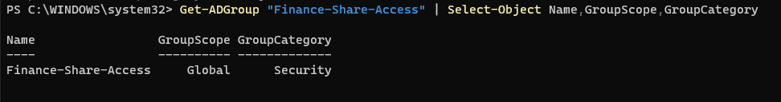
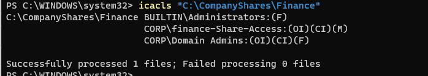
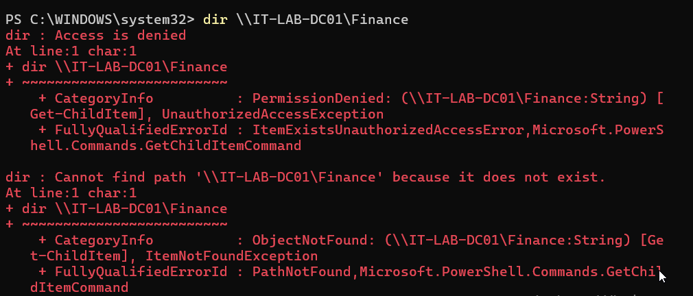
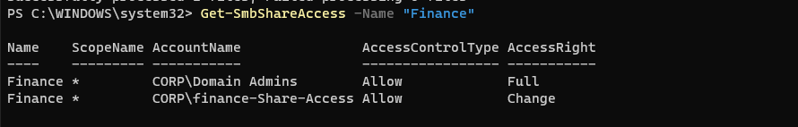
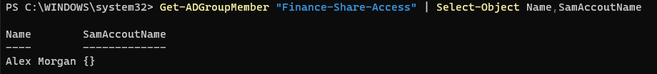
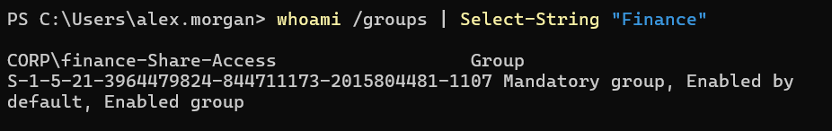
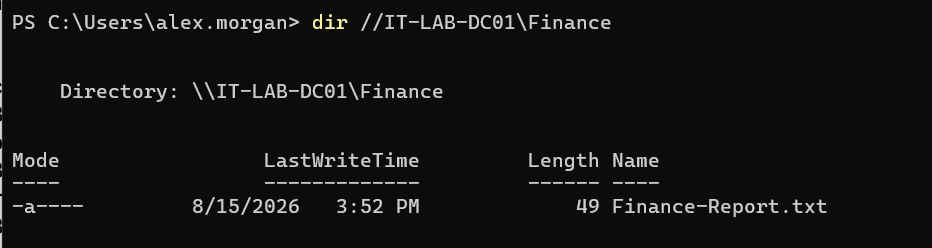
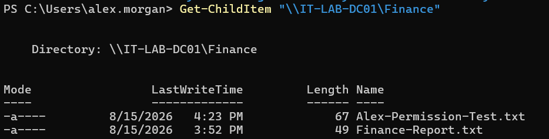

# INC-015 — Shared Folder & NTFS Permissions Troubleshooting

## Ticket Summary

A domain user reported receiving an **Access Denied** error when attempting to access a departmental network share.

The issue was investigated by validating network connectivity, SMB share configuration, NTFS permissions, Active Directory security group membership, and the user's Windows security token.

The root cause was identified as missing membership in the Active Directory security group authorized to access the Finance share.

The user was added to the appropriate security group, the user's Windows logon session was refreshed, and both read and modify access to the network share were successfully verified.

## Environment

- Windows Server
- Windows 11 Professional
- Active Directory Domain Services (AD DS)
- PowerShell
- Server Message Block (SMB)
- NTFS permissions
- Domain: corp.jasmine.lab
- Domain Controller: IT-LAB-DC01
- Workstation: IT-LAB-WIN11
- User: Alex Morgan
- User Account: alex.morgan
- Security Group: Finance-Share-Access
- Network Share: \\IT-LAB-DC01\Finance
- Share Location: C:\CompanyShares\Finance

## User Impact

Alex Morgan was unable to access the Finance departmental network share.

An attempt to enumerate the share using:

```powershell
dir \\IT-LAB-DC01\Finance
```

returned:

```text
Access is denied.
```

PowerShell also reported:

```text
PermissionDenied
UnauthorizedAccessException
```

The user therefore could authenticate to the domain but could not access the required departmental resource.

## Initial Investigation

The Finance directory was created on IT-LAB-DC01:

```text
C:\CompanyShares\Finance
```

A test departmental document was placed in the directory:

```text
Finance-Report.txt
```

An Active Directory security group named:

```text
Finance-Share-Access
```

was created to manage access to the departmental resource.

Access was intentionally managed through security-group membership rather than assigning permissions directly to individual users.

## NTFS Permission Configuration

NTFS inheritance was removed from the Finance folder and explicit permissions were configured.

Permissions were reviewed using:

```powershell
icacls "C:\CompanyShares\Finance"
```

The resulting permissions included:

```text
BUILTIN\Administrators:(F)
CORP\Finance-Share-Access:(OI)(CI)(M)
CORP\Domain Admins:(OI)(CI)(F)
```

Members of `Finance-Share-Access` therefore had **Modify** NTFS permission on the Finance folder and its child objects.

Domain administrators retained Full Control.

## SMB Share Configuration

The Finance directory was published as an SMB network share:

```powershell
New-SmbShare -Name "Finance" -Path "C:\CompanyShares\Finance" -FullAccess "CORP\Domain Admins" -ChangeAccess "CORP\Finance-Share-Access"
```

The resulting UNC path was:

```text
\\IT-LAB-DC01\Finance
```

Share permissions granted:

- Domain Admins — Full
- Finance-Share-Access — Change

This allowed access to be controlled through the Finance security group at both the SMB share and NTFS layers.

## Connectivity Investigation

Before treating the incident as a permissions issue, connectivity to the SMB service was tested from IT-LAB-WIN11.

The workstation successfully communicated with IT-LAB-DC01 over TCP port 445.

This established that the server and SMB service were reachable and helped distinguish the incident from a network-connectivity failure.

## Access Failure Reproduction

While logged into IT-LAB-WIN11 as:

```text
CORP\alex.morgan
```

the Finance share was accessed using:

```powershell
dir \\IT-LAB-DC01\Finance
```

The attempt returned:

```text
Access is denied.
```

Because connectivity to the server was available, the investigation shifted from network troubleshooting to authorization and permissions.

## Security Group Investigation

The user's current Windows security groups were reviewed using:

```powershell
whoami /groups
```

The required group:

```text
CORP\Finance-Share-Access
```

was not initially present.

Active Directory group membership was also investigated from the domain controller.

The Finance-Share-Access group did not initially contain Alex Morgan.

This identified a likely authorization problem.

## Share Permission Verification

The SMB share permissions were reviewed on IT-LAB-DC01 using:

```powershell
Get-SmbShareAccess -Name "Finance"
```

The Finance-Share-Access security group was authorized to access the share with Change permissions.

This confirmed that the SMB share configuration itself was correct.

## NTFS Permission Verification

The underlying filesystem permissions were independently reviewed using:

```powershell
icacls "C:\CompanyShares\Finance"
```

The results confirmed:

```text
CORP\Finance-Share-Access:(OI)(CI)(M)
```

Therefore, the required security group had Modify access at the NTFS layer as well.

At this stage:

- Network connectivity was functional
- SMB was reachable
- The Finance share existed
- Share permissions were correct
- NTFS permissions were correct
- Alex Morgan lacked membership in the authorized security group

The problem was isolated to Active Directory group membership.

## Root Cause

Alex Morgan was not a member of:

```text
Finance-Share-Access
```

The Finance share was intentionally configured to grant access through this Active Directory security group.

Because Alex was not a member, the user's Windows security token did not contain the group SID required to authorize access to the resource.

## Resolution

Alex Morgan was added to the Finance security group using:

```powershell
Add-ADGroupMember -Identity "Finance-Share-Access" -Members "alex.morgan"
```

Membership was verified from Active Directory.

The user's existing Windows session was then signed out and a new domain logon session was established.

This was necessary so Windows could generate a new security token reflecting the updated Active Directory group membership.

## Security Token Verification

After signing back into IT-LAB-WIN11, the user's group membership was verified using:

```powershell
whoami /groups | Select-String "Finance"
```

The results showed:

```text
CORP\Finance-Share-Access
```

with the group enabled in the user's security token.

This confirmed that the updated authorization information was active on the workstation.

## Access Verification

The Finance share was tested again:

```powershell
dir \\IT-LAB-DC01\Finance
```

The operation completed successfully and the user was able to view:

```text
Finance-Report.txt
```

This confirmed that read access to the departmental share had been restored.

## Modify Permission Verification

Because the Finance-Share-Access group was assigned Modify permissions, write access was also tested.

A test file was created remotely from IT-LAB-WIN11:

```powershell
Set-Content "\\IT-LAB-DC01\Finance\Alex-Permission-Test.txt" -Value "File created by Alex Morgan to verify Finance share modify access."
```

The share contents were then enumerated and both files were visible:

```text
Alex-Permission-Test.txt
Finance-Report.txt
```

The test file was subsequently deleted:

```powershell
Remove-Item "\\IT-LAB-DC01\Finance\Alex-Permission-Test.txt"
```

Successful file creation and deletion confirmed that Alex had the intended **Modify** permissions.

## Resolution Summary

**Issue:** User received Access Denied when accessing a departmental network share.

**Affected User:** Alex Morgan

**Affected Workstation:** IT-LAB-WIN11

**Resource:** \\IT-LAB-DC01\Finance

**Root Cause:** User was not a member of the Active Directory security group authorized at the SMB and NTFS permission layers.

**Resolution:** Added Alex Morgan to Finance-Share-Access and refreshed the user's Windows logon session.

**Verification:** Confirmed updated security-token membership, successful share access, file visibility, file creation, and file deletion.

**Status:** Resolved

## Skills Demonstrated

- Active Directory administration
- Active Directory security groups
- SMB file sharing
- UNC path troubleshooting
- NTFS permissions
- Share permissions
- Windows security tokens
- TCP port 445 connectivity testing
- PowerShell administration
- `Get-SmbShare`
- `Get-SmbShareAccess`
- `icacls`
- `whoami /groups`
- `Add-ADGroupMember`
- Access Denied troubleshooting
- Authentication vs. authorization troubleshooting
- Least-privilege access management
- Root-cause analysis
- Help desk incident documentation

## Screenshots

### Active Directory Security Group Created
The Finance-Share-Access security group was created to manage access to the departmental network share.



### NTFS Permissions Configured
NTFS permissions were configured to grant the Finance-Share-Access security group Modify access to the Finance directory.



### Access Denied Reproduced
The affected user attempted to access the Finance network share and received an Access Denied error.



### Share Permissions Verified
SMB share permissions were reviewed to confirm that Finance-Share-Access was authorized to access the Finance share.



### User Added to Finance Security Group
Alex Morgan was added to the Finance-Share-Access Active Directory security group after group membership was identified as the root cause.



### Updated Security Token Verified
After a new Windows logon session was established, the user's security token showed membership in CORP\Finance-Share-Access.



### Finance Share Access Restored
The user successfully accessed the Finance network share and viewed the departmental file after remediation.



### Modify Permission Verified
A test file was successfully created on the Finance share, confirming that the user had the intended Modify permissions.

